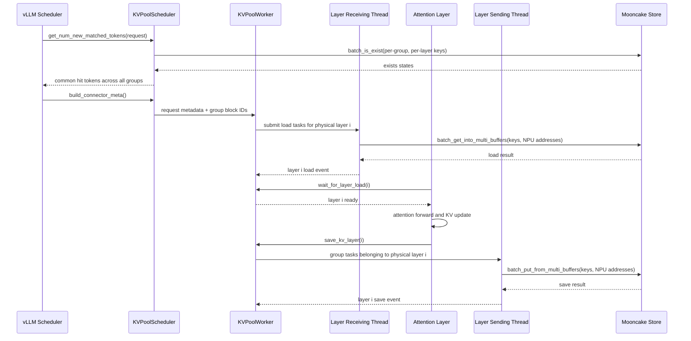

# Mooncake Layerwise AscendStoreConnector Design

本文记录 `AscendStoreConnector` 使用 Mooncake backend 进行 layerwise KV
cache 保存和加载的实现。重点是 Mooncake 的 key-based 数据路径、hybrid KV
cache group 的处理，以及 DeepSeek-V4/GLM-5 多 attention cache、Qwen3.5
Full Attention/GDN state 与 Kimi-K3 MLA/KDA state 这些 hybrid 布局。

使用方法和部署参数参见
[Layerwise KV Pool](../../user_guide/feature_guide/layerwise_kv_pool.md)。本文面向后续维护、
模型扩展和问题定位，不重复完整的部署步骤。

## 1. 背景与目标

普通 KV Pool 在完整 forward 前后批量加载或保存 KV cache。长 prompt 下，整批传输会形成
明显的串行等待。Layerwise 模式把传输点移动到每一层 attention 的前后：

- attention 计算前等待当前层的 KV load 完成；
- attention 写完当前层 KV 后立即提交 save；
- 下一层的传输与当前层计算尽量重叠。

原有 layerwise 实现主要依赖 Memcache 的 GVA（Global Virtual Address）路径，并假设：

- 只有一个 KV cache group；
- 所有 group 使用同一个 block size；
- 模型层号可以直接作为 group 内 layer index；
- 每个 layer 拥有相同数量的 cache tensor。

这些假设不适用于 DeepSeek-V4。DeepSeek-V4 的 sliding-window、compressed attention、
indexer/compressor 等 cache 会形成多个 group；不同 group 的 block size、层集合和每层
cache entry 数量也可能不同。

本实现的目标是：

1. 让 `backend: "mooncake"` 可以启用 `use_layerwise: true`；
2. 使用 Mooncake 的 key-based `batch_put_from_multi_buffers` 和
   `batch_get_into_multi_buffers` 完成真实 NPU buffer 读写；
3. 正确支持多个 attention KV cache group；
4. 支持 `mamba_cache_mode=align` 的 conv/SSM recurrent state；
5. 以所有 group 的公共可恢复命中作为可加载前缀，避免部分 group 命中导致状态不一致；
6. 保持 Memcache GVA buffer reuse 路径的既有行为。

以下内容不在当前范围内：

- Mooncake 上的跨层 NPU buffer reuse；
- `mamba_cache_mode=none` 或 `all` 的 state layerwise 持久化；
- layerwise 与 context parallel 的组合；
- layerwise TP-mismatch 数据重排。

## 2. Mooncake 与 Memcache 路径的边界

`use_layerwise` 表示按层调度传输，但不再等价于 Memcache GVA 模式。

```text
use_layerwise = true
        |
        +-- backend = memcache
        |       `-- GVA layerwise path + optional cross-layer buffer reuse
        |
        `-- backend = mooncake
                `-- key-based layerwise path, no cross-layer buffer reuse
```

代码中通过 `use_gva_layerwise` 明确区分两条路径：

```python
use_gva_layerwise = use_layerwise and backend_name == "memcache"
```

因此：

- `layerwise_num_shared_buffers` 等 buffer reuse 参数只对 Memcache 生效；
- Mooncake 复用 vLLM 已分配的 KV cache buffer，并直接注册这些 NPU 地址；
- 两种 backend 共用 scheduler/worker 的 layerwise 调度框架，但使用不同的发送和接收线程。

## 3. 总体架构



主要组件如下：

| 组件 | 文件 | 职责 |
| :--- | :--- | :--- |
| `AscendStoreConnector` | `ascend_store_connector.py` | 对接 vLLM KV Connector V1 API，转发 scheduler/worker 调用 |
| `KVPoolScheduler` | `pool_scheduler.py` | 远端命中查询、公共命中长度计算、构造请求 metadata |
| `KVPoolWorker` | `pool_worker.py` | 注册 KV buffer、建立物理层到 group 的映射、生成按层任务和同步事件 |
| `ChunkedTokenDatabase` | `metadata.py` | token hash、Mooncake key、group buffer 地址与切片计算 |
| `KVCacheStoreKeyLayerSendingThread` | `kv_transfer.py` | 按物理层收集多个 group 的 save task 并调用 Mooncake put |
| `KVCacheStoreKeyLayerRecvingThread` | `kv_transfer.py` | 按物理层收集多个 group 的 load task 并调用 Mooncake get |
| `MooncakeBackend` | `backend/mooncake_backend.py` | 包装 Mooncake Distributed Store 的 batch API |

## 4. Hybrid KV Cache Group 建模

### 4.1 三种 layer 标识

Hybrid 模式必须区分三种编号：

| 标识 | 含义 |
| :--- | :--- |
| `physical_layer` | 模型 forward 顺序中的真实物理层号 |
| `group_id` | vLLM `KVCacheConfig` 中的 cache group 编号 |
| `layer_idx_in_group` | 某个物理层在指定 group 的有序唯一层集合中的下标 |

一个物理层可以出现在多个 group 中。例如：

```text
physical layer 2 -> [(group 0, layer 0), (group 4, layer 0), (group 6, layer 0)]
physical layer 3 -> [(group 1, layer 0), (group 5, layer 0), (group 7, layer 0)]
```

`KVPoolWorker._init_layerwise_config()` 从每个 group 的 `layer_names` 提取物理层号，去重、
排序后生成：

```python
physical_layer_to_group_layers: dict[int, list[tuple[group_id, layer_idx_in_group]]]
```

同一物理层中的多个 cache name 不会被错误地当成多个模型层，而是作为该 group、该层的
多个 cache entry。

### 4.2 每个 group 独立的布局信息

以下数据都按 group 保存，不能再使用 group 0 的值替代：

- `grouped_block_size[group_id]`；
- `group_num_layers[group_id]`；
- `block_ids_by_group[group_id]`；
- `group_kv_caches_base_addr[group_id]`；
- `group_block_len[group_id]`；
- `group_block_stride[group_id]`；
- `group_layer_cache_entry_offsets[group_id]`。

`group_layer_cache_entry_offsets` 用于解决“每层 cache entry 数量不同”的问题。若某 group
有两层，cache entry 分布为 2 个和 1 个，则 offsets 为：

```text
[0, 2, 3]
```

这样 group 内 layer 0 对应 entry `[0, 2)`，layer 1 对应 entry `[2, 3)`，无需假设
`len(group_addrs) / num_layers` 对所有层都成立。

### 4.3 地址切片

`ChunkedTokenDatabase.prepare_value_layer()` 接收 `kv_cache_group_id` 和 group-local
`layer_id`。对每个 cache entry，Mooncake 使用的地址和长度为：

```text
address = group_base_address[entry] + block_id * group_block_stride[entry]
size    = group_block_length[entry] / group_block_size * token_range_length
```

返回的 `addr_list`/`size_list` 可以直接传给 Mooncake multi-buffer API。数据不经过额外
CPU staging buffer。

## 5. Mooncake Key 设计

Layerwise key 必须同时区分模型、并行 rank、cache group、cache family、物理数据角色、
group-local layer 和 token hash。当前格式为：

```text
{model_name}
@pcp{pcp_rank}
@dcp{dcp_rank}
@head_or_tp_rank:{rank}
@group:{group_id}
@cache_role:{cache_role}
@cache_family:{cache_family}
@layer_id:{layer_idx_in_group}
@{chunk_hash}
```

单行示例：

```text
DeepSeek-V4@pcp0@dcp0@head_or_tp_rank:0@group:1@cache_role:kv@cache_family:c4@layer_id:2@<hash>
```

字段作用：

- `group` 防止不同 block size/layout 的 group 发生 key 冲突；
- `cache_role` 为 KV 与其他可能的数据类型保留命名空间；
- `cache_family` 描述压缩布局，常见值为 `c1`、`c4`、`c128`、`mixed` 和 `default`；
- `layer_id` 是 group-local index，不是直接使用全局物理层号；
- `chunk_hash` 保持与 vLLM prefix hashing 一致。

`cache_family` 优先从 group 的 cache spec 推断；若 spec 没有直接给出，则结合模型
`compress_ratios` 和 layer name 推断。DeepSeek-V4 使用自己的层号提取和压缩比逻辑。

需要特别区分两个概念：

- `cache_family` 只属于 AscendStore key namespace，用来避免不同压缩布局发生 key 冲突；
- block 是否仍可能被模型读取，必须由 vLLM 的 `KVCacheSpec` 和对应 cache manager 决定。

例如 DeepSeek-V4 同一个物理层中可以同时出现 compressed cache 和 sliding-window cache。
此时 SWA group 的 key family 可能因为父层压缩比被标记为 `c4` 或 `c128`，但该 group 的
实际 spec 仍是 `SlidingWindowSpec`。不能根据 `cache_family` 把它当作 Full Attention。

## 6. Scheduler 侧命中计算

### 6.1 为什么不能只查询一个 group

一个请求只有在所有 attention KV group 都具备相同连续前缀时才能安全跳过计算。若主 KV
命中 128 token，但 indexer/compressor 只命中 64 token，则把 128 token 全部视为命中会
产生不完整状态。

### 6.2 查询算法

`_get_hybrid_layerwise_store_hit_tokens()` 使用与 worker 相同的
`AscendStoreCoordinator` 执行：

1. 按 `hash_block_size` 截取请求的基础 block hash；
2. 调用 `lookup_mask()`，由各 group 的 vLLM cache manager 标记当前前缀实际可恢复的 block；
3. 使用该 group 的 block size 调用 `get_block_hashes()`，仅为 mask 允许的 block 生成所有
   layer key；
4. 调用 Mooncake `batch_is_exist()`，只有一个 block 的全部 layer key 都存在时才把它加入
   `ExternalCachedBlockPool`；
5. 调用 `find_longest_cache_hit()`，由 vLLM hybrid coordinator 计算所有 group 的公共可恢复
   前缀；
6. 向下对齐到 `cache_transfer_granularity`。

公式为：

```text
reachable = coordinator.lookup_mask(candidate_tokens)
external_pool = query_all_reachable_layer_keys(reachable)
common_hit_tokens = floor_to_transfer_granularity(
    coordinator.find_longest_cache_hit(external_pool)
)
```

Layerwise 查询固定从远端 block 0 开始，而不是从本地已计算 token 之后开始。原因是远端
按层数据与本地 prefix cache 的物理 buffer 不一定一致；worker 需要获得完整的远端可加载
范围，再由 load spec 决定实际地址和计算边界。

### 6.3 传输粒度

Hybrid group 的 `cache_transfer_granularity` 由相关 group block size 推导，通常受它们的
最小公倍数约束。测试 tiny 模型时需要特别注意：若某层 `compress_ratio=128`，传输粒度
可能达到 4096 token；短于该长度的 prompt 不会形成可保存或可加载的完整传输单元。

这不是 Mooncake put/get 未执行，而是 scheduler 正确地拒绝了不完整 group 快照。

### 6.4 SWA 可达性与 null block

#### 问题表现

vLLM 的 `SlidingWindowManager` 会释放窗口之外的物理 KV block，并在逻辑 block table 中用
保留的 `NULL_BLOCK_ID=0` 占位。逻辑前缀长度仍然完整，但旧 SWA block 已经不可读取，也
不应被写入或从 AscendStore 恢复。

修复前存在三条绕过该语义的路径：

1. `AscendStoreCoordinator._reachable_masks()` 根据 `cache_family` 决定是否调用 cache
   manager。标记为 `c4/c128` 的 SWA group 会被错误地当作全部可达；
2. non-layerwise 只对 Mamba align group 过滤 null block，普通 SWA group 的 block 0
   仍可能进入 Mooncake GET/PUT；
3. Mooncake layerwise 直接创建连续的 `[start_block, end_block)` task，没有使用 per-group
   reachability mask，因此会为不可达 SWA block 生成逐层 key 和传输任务。

该问题不是 vLLM 的 SWA block 管理错误。vLLM MooncakeStore 的处理包含两道保护：

```text
KVCacheSpec
  -> KVCacheSpecRegistry.get_manager_class(spec)
  -> manager.reachable_block_mask(...)
  -> token/key candidate selection and TP sharding
  -> skip source/destination block when block_id == NULL_BLOCK_ID
  -> Mooncake GET/PUT
```

第一道保护减少不必要的 key 查询和数据传输；第二道保护防止异常或不完整 metadata 导致
block 0 被作为真实地址使用。

#### AscendStore 修复

`AscendStoreCoordinator` 现在对每个 group 都根据实际 `KVCacheSpec` 获取 manager 并调用
`reachable_block_mask()`。`cache_family` 不再参与 reachability 分支：

```text
FullAttentionSpec  -> FullAttentionManager    -> all blocks reachable
SlidingWindowSpec  -> SlidingWindowManager    -> only window-reachable blocks
MambaSpec          -> MambaManager            -> mode-specific state blocks
```

non-layerwise 路径保留正常的逻辑候选顺序，先完成 `put_step`/TP candidate selection，再在
真正构造 Mooncake地址前统一跳过 `block_id <= 0`。过滤不能提前到 TP 分片之前，否则删除
null block 会改变后续 key 的 rank 归属。

Mooncake key-based layerwise 路径执行以下处理：

1. 每个请求、每个 step 分别计算一次 store/load mask；
2. mask 在该请求的所有物理层之间复用，避免每层重复执行 manager 推断；
3. 把允许传输的 block 合并为连续 `LayerBlockRange`；
4. 每个 group 只为这些 range 创建逐层 GET/PUT task；
5. key-based sending/receiving thread 在最终地址解析后再次跳过 block 0。

Scheduler 侧也必须应用同一个 `lookup_mask()`。如果只在 worker 侧裁掉不可达 SWA block，
而 scheduler 仍要求所有逻辑 block 的逐层 key 存在，热请求会因为这些“有意不保存”的 key
缺失而把公共命中错误压成 0，最终不会触发 Mooncake get。Scheduler 和 worker 共用
coordinator 后，保存范围、存在性查询和最长前缀计算使用同一份 vLLM reachability 语义。

例如 mask 为：

```text
[False, True, True, False, True]
```

生成的 layerwise range 是：

```text
[1, 3), [4, 5)
```

而不是原来的 `[0, 5)`。

#### MemCache/GVA 边界

MemCache layerwise 会在独立准备阶段按连续范围分配 GVA blob，并在所有层复制完成后调用
write-finish。若只在 layer task 阶段套用稀疏 mask，可能出现某个 blob 已分配和 publish，
但对应 NPU 数据没有复制的问题。

因此本次稀疏 `LayerBlockRange` 优化只用于 Mooncake key-based layerwise 路径。
`use_gva_layerwise=true` 时保持既有连续 GVA 语义。后续若要优化 MemCache SWA，需要同时
修改 GVA 分配、lease、batch-copy 和 write-finish 的 key 集合，不能只复用 task mask。

## 7. Worker 侧任务生成

`process_layer_data()` 每个 step 都重新建立任务，避免异步线程仍持有上一 step 的 list：

```text
for physical_layer in model order:
    for (group_id, layer_idx_in_group) owned by physical_layer:
        build save task

prepare load/save shared metadata

for physical_layer in model order:
    for (group_id, layer_idx_in_group) owned by physical_layer:
        build load task
```

一个 `LayerTransferTask` 同时携带：

- `layer_id`：物理层号，用于 attention 时序和 layer event；
- `group_id`：选择 block size、block IDs、key namespace 和 buffer；
- `layer_idx_in_group`：选择 group 内 layer key 和 cache entry；
- `block_ranges`：该 request 在该 group 中需要保存或加载的 block 范围。

同一物理层的多个 group task 会一起提交给 Mooncake layer thread。线程要求 task 的
`layer_id` 相同，但允许包含多个 `group_id`。

对于 SWA 等带稀疏 reachability 的 group，一个 request 在同一 task 中可以对应多个
`LayerBlockRange`。Request completion 的注册计数以实际 range 数量为准，因此拆分 range
不会提前释放 scheduler 持有的 block，也不会在最后一层之前错误地报告保存完成。

## 8. 保存路径

完整保存调用链如下：

```text
attention forward
  -> maybe_save_kv_layer_to_connector(layer_name, kv_cache)
  -> AscendStoreConnector.save_kv_layer()
  -> KVPoolWorker.save_kv_layer()
  -> KVCacheStoreKeyLayerSendingThread
  -> MooncakeBackend.put()
  -> MooncakeDistributedStore.batch_put_from_multi_buffers()
```

关键行为：

1. `KVPoolWorker` 在当前 compute stream 上记录 `torch.npu.Event`；
2. sending thread 按 group 生成 token ranges 和 layer keys；
3. 通过 `prepare_value_layer()` 解析真实 NPU 地址；
4. 先查询 key 是否已存在，只 put 缺失 key；
5. put 前同步当前物理层的 NPU event，保证 KV 写入已完成；
6. 一个物理层的所有 group put 完成后设置 `layer_save_finished_events[layer]`；
7. 最后一层负责推进 request-level sending completion。

Mooncake path 使用 group-specific `process_tokens()` 缓存，避免为同一 group 的每一层重复
计算 token hash。

### `put_step` 的处理

`KVPoolWorker` 已经只在每个 `put_step` group 的指定 rank 上创建 save task。因此 sending
thread 不能再次用 TP rank 对 block/key 列表切片，否则会静默丢失其他 block。当前实现由
被选中的 rank 发布该 task 的全部 block。

## 9. 加载路径

完整加载调用链如下：

```text
scheduler remote lookup
  -> LoadSpec(can_load=True, kvpool_cached_tokens=N)
  -> AscendStoreConnector.start_load_kv()
  -> KVPoolWorker.process_layer_data()
  -> KVCacheStoreKeyLayerRecvingThread
  -> MooncakeBackend.get()
  -> MooncakeDistributedStore.batch_get_into_multi_buffers()
  -> layer_load_finished_events[layer]
  -> attention wait_for_kv_layer_from_connector()
```

Receiving thread 对每个 group：

1. 按 group block size 从基础 hash 生成 group block hash；
2. 使用 group-local layer index 生成 layer key；
3. 使用 `block_ids_by_group[group_id]` 解析目标 NPU block；
4. 构造 multi-buffer 地址和长度；
5. 调用 Mooncake get，把数据直接写入 vLLM KV cache；
6. 全部 group 完成后释放当前物理层的 load event。

`layerwise_prefetch_layers` 控制提前提交多少后续层。Attention 到达层边界时仍会调用
`wait_for_layer_load()`，因此预取只改变重叠程度，不改变正确性约束。

### 9.1 Align recurrent state 的 forward 前恢复

Full Attention KV 可以在每层 attention 计算前加载，但 align 模式的 recurrent state
不能完全沿用这个时序。模型 runner 的顺序是：

```text
preprocess_mamba()                 # 生成 prev -> running state 的 copy metadata
  -> AscendStoreConnector.start_load_kv()
  -> KVPoolWorker._preload_align_state()
  -> MooncakeBackend.get()         # 同步恢复所有 align state group
  -> do_mamba_copy_block()         # 把已恢复 checkpoint 复制到 running state
  -> model forward
```

如果等到 GDN/KDA 层的普通 layer callback 才执行 get，`do_mamba_copy_block()` 已经把 HBM
中的旧 checkpoint 复制到了本轮运行槽位；之后即使 Mooncake 正确恢复原 checkpoint，计算
仍会读取错误的 running state。因此 worker 在构造完 layer load task 后，把
`group_uses_align_state=true` 的任务合并为一次同步 batch get。普通 attention task 仍按层
提交，与模型计算重叠。

预加载后的 state task 不从 layer task list 删除，而是标记为 `preloaded`。后续层线程只
执行 event 和 request completion accounting，不重复调用 Mooncake get。这样最后一个物理层
恰好是 state layer 时，也不会丢失 request-level receiving completion。

## 10. 模型适配

### 10.1 Scheduler block size 与物理 page size

vLLM hybrid scheduler 会把全局 `cache_config.block_size` 归一化为最小逻辑 group size。
DeepSeek-V4 中这个值可能变为 2，但 SFA indexer 的物理 page 仍要求 32、64 或 128。

如果 worker 在归一化之后直接重新调用 `get_kv_cache_spec(self.vllm_config)`，会错误地用
逻辑值 2 重建 indexer spec，最终导致 cache 初始化失败。

处理方式：

- 优先保留 scheduler 归一化前已经生成的 `AscendSFAIndexerCacheSpec`；
- 确实需要重建时，浅拷贝 `vllm_config` 和 `cache_config`；
- 只在副本中把 `block_size` 恢复为 `self.block_size`；
- 不修改 scheduler 使用的全局归一化配置。

### 10.2 Dummy 权重验证

真实 checkpoint loader 会把 DeepSeek-V4 `wo_a.weight` 从二维权重打包为
`[n_local_groups, hidden_size, o_lora_rank]`。`--load-format dummy` 跳过该 loader，导致
第一次 DSA forward 在 `npu_transpose_batchmatmul` 中维度错误。

`AscendDSAImpl.process_weights_after_loading()` 现在只对未处理的二维、非 A5 权重执行与
真实 loader 相同的 reshape/transpose；已经是三维的真实权重和在线 reload 权重保持不变。
该适配用于小模型随机权重的 connector 测试，不改变真实 checkpoint 的布局。

### 10.3 Qwen3 Dense

Qwen3 Dense 使用标准 Full Attention 和单个 KV cache group。每个 attention layer 都通过
vLLM 通用 attention wrapper，在读取 KV 前等待 layer load，并在 attention 完成后触发
layer save。因此它可以直接复用 group-aware Mooncake layerwise 数据路径，不需要按模型名
增加分支或单独定义 key schema。

`tests/e2e/pull_request/one_card/test_qwen3_mooncake_layerwise.py` 使用
`Qwen/Qwen3-0.6B` BF16 真实权重验证：

- 模型包含 28 个 Full Attention layer，Mooncake master 观测到 28 次 put start/end；
- 第二次相同请求观测到 28 次 get，并命中 128 个外部 KV token；
- put/get failure 均为 0，Mooncake 中至少存在 28 个 layer key；
- 两次请求的生成文本、prompt token 数和 completion token 数一致。

该结论覆盖使用 `Qwen3ForCausalLM` 标准 Full Attention 路径的 Qwen3 Dense 系列。当前测试
没有覆盖 Qwen3 MoE。Qwen3.5 hybrid 的状态路径见下一节。

### 10.4 Qwen3.5 Hybrid

Qwen3.5 每四个 decoder layer 中包含三个 GDN layer 和一个 Full Attention layer。Full
Attention 继续使用通用 attention layerwise hook；GDN 则原地更新两个 state tensor：
conv state 和 SSM recurrent state。

为保证状态恢复发生在第一次读取之前，`AscendGatedDeltaNetAttention._forward_core()` 在
取得当前层 state 前调用 `wait_for_kv_layer_from_connector(self.prefix)`，并在 conv/SSM
都完成更新后调用 `maybe_save_kv_layer_to_connector()`。该顺序同时覆盖 eager 和
`torch.compile` custom-op 路径。

Qwen3.5 使用 `mamba_cache_mode=align`。其 block table 为完整逻辑前缀保留位置，但历史
位置指向保留的 null block 0，只有当前 checkpoint 对应真实 state block。Worker 把
`group_uses_align_state` 写入 request；Mooncake key-based layer thread 在保存和加载时跳过
null block，只传输有效 block 中同一物理层的 conv/SSM 两个 cache entry。Scheduler 对
attention group 使用连续命中，对 aligned state group 使用离散 checkpoint 命中，最终仍
取所有 group 的公共可恢复 token 位置。

所有 aligned state group 会在 `start_load_kv()` 中先合并恢复，再由 runner 执行实际的
checkpoint-to-running-state copy；Full Attention group 仍在各 attention layer 前逐层恢复。
这一区分对 Qwen3.5 GDN 和 Kimi-K3 KDA 使用相同的通用 cache-spec 判断，不依赖模型名。

Mooncake 的 key-based layerwise load 会从 block 0 恢复已在外部存储中验证的完整前缀，
即使 vLLM 本地 prefix cache 报告相同长度的 HBM 命中也不会省略 get。原因是统一的 token
命中长度不能证明每个 GDN layer 的 recurrent state 仍在本地可用。Memcache GVA 路径仍对
独立常驻层保留原有的本地命中优化。

验证分为两层：

- `test_mooncake_kimi_k3_aligned_kda_state_roundtrip` 使用真实 Mooncake backend，将随机
  conv/recurrent NPU state 保存、覆写后恢复，并要求有效 block bitwise equal、null block
  未被写入；这与 Qwen3.5 的两个 aligned state entry 使用相同传输语义；
- `test_qwen3_5_mooncake_layerwise.py` 使用 `Qwen/Qwen3.5-0.8B` BF16 真实 checkpoint，
  以超过 1024 tokens 的完整 hybrid transfer unit 重复请求，同时覆盖 18 个 GDN layer 和
  6 个 Full Attention layer，并检查 24 次 put、24 次 get 及零失败计数。

### 10.5 GLM-5 系列

GLM-5、GLM-5.1 和 GLM-5.2 复用 DeepSeek Sparse Attention 架构。在 Ascend 上，
DSA/SFA 实现都已经在读取主 KV 前调用 layer wait，并在主 KV 与 lightning indexer
cache 写完后调用 layer save。GLM-5.2 中部分层持有 `main + indexer`，部分层只持有
`main`；worker 使用 `group_layer_cache_entry_offsets` 表达这种不等长布局，同一个物理层
的多个 entry 会作为一次 Mooncake layer transfer 提交。

因此 GLM 不需要基于模型名增加 connector 分支。
`test_component_sharing_merges_main_across_a_and_b_layers` 验证 GLM-5.2 的 A/B layer
物理布局；Mooncake hybrid roundtrip 使用 main/indexer 不等长 entry 进行真实 NPU
put/get，并要求逐块 bitwise equal。当前不声明 layerwise 与 DSA context parallel 的组合
支持。

### 10.6 Kimi 系列

Kimi-K2、Kimi-K2.5 和 Kimi-K2.6 的语言模型走通用 MLA 路径，可直接复用 MLA
layerwise hook。Kimi-K3 是 MLA 与 KDA 的 hybrid 模型：MLA 部分同样复用通用路径，
KDA 每层原地更新 conv state 和 recurrent state。

`AscendKimiK3DeltaAttention._forward()` 在取得 KDA state 前等待当前层 load，在 conv 与
recurrent kernel 都完成并更新 state 后触发 save。和 Qwen3.5 一样，传给 save callback
的 tensor list 为空，因为 connector 使用初始化时注册的 `MambaSpec` NPU 地址；callback
只负责声明该层状态已经可读。KDA 状态传输目前要求 `mamba_cache_mode=align`。

本次支持范围是 Kimi-K3 baseline inference。RecoverSSM 会额外增加 correction/key-gate
record state，当前 Ascend KDA forward 尚未实现该状态路径；DSpark 与 CP 也没有纳入本次
layerwise 验证，因此不应据此声明支持。

## 11. 配置示例

Mooncake 配置示例：

```json
{
    "metadata_server": "P2PHANDSHAKE",
    "protocol": "ascend",
    "device_name": "",
    "master_server_address": "127.0.0.1:50051",
    "global_segment_size": "1GB",
    "local_buffer_size": "64MB",
    "preferred_segment": false,
    "prefer_alloc_in_same_node": true
}
```

vLLM connector 配置：

```json
{
    "kv_connector": "AscendStoreConnector",
    "kv_role": "kv_both",
    "kv_connector_extra_config": {
        "backend": "mooncake",
        "lookup_rpc_port": "0",
        "use_layerwise": true,
        "layerwise_prefetch_layers": 1
    }
}
```

建议测试时关闭本地 prefix caching，以便第二个相同请求明确经过外部 KV Pool：

```bash
--no-enable-prefix-caching
```

生产环境是否关闭本地 prefix caching 应根据本地/远端命中率和内存策略决定。

## 12. 正确性验证

### 12.1 单元测试

相关测试覆盖：

- layerwise Mooncake backend 配置接受；
- group-local block size、layer index 和 block IDs；
- 多个 group task 在同一物理层的 save/load；
- group-specific key 生成与 key 数量；
- hybrid scheduler 取所有 group 的公共命中；
- DeepSeek-V4 indexer spec 在 block normalization 后仍保留物理 page size；
- dummy `wo_a` 的幂等打包。
- `c4/c128` key family 不会屏蔽 `SlidingWindowManager` 的 reachability；
- non-layerwise 在 candidate selection 后跳过 block 0；
- Mooncake layerwise save/load 按 group mask 拆分连续 range；
- Mamba hint 为 false 的普通 cache group 同样不会传输 null block。

测试命令：

```bash
python -m pytest -q \
    tests/ut/distributed/ascend_store \
    tests/ut/kv_offload/test_mooncake_connector.py \
    tests/ut/worker/a2/test_model_runner_v1.py \
    tests/ut/attention/test_dsa_v1.py::test_process_weights_after_loading_packs_dummy_wo_a
```

当前验证结果为 `461 passed`。

本次 SWA/null-block 优化在 Ascend 测试环境额外执行了完整
`tests/ut/distributed/ascend_store`，结果为：

```text
322 passed
ruff: all checks passed
```

### 12.2 真实 Mooncake NPU roundtrip

`tests/e2e/pull_request/one_card/test_mooncake_layerwise_roundtrip.py` 启动真实
`mooncake_master`，使用 `protocol: "ascend"` 和真实 NPU tensor：

1. 创建两个 block size 不同的 cache group；
2. 每个 group 使用不同的 layer/cache entry 布局；
3. 使用随机 FP16 KV 数据；
4. 通过 layer sending thread 调用真实 Mooncake put；
5. 把目标 NPU block 填成 sentinel；
6. 通过 layer receiving thread 调用真实 Mooncake get；
7. 逐 group、逐 cache entry、逐 block 比较原始值；
8. 确认未加载 block 仍为 sentinel。

实测结果：

```json
{
    "put_calls": 2,
    "put_keys": 6,
    "put_bytes": 1984,
    "get_calls": 2,
    "get_keys": 6,
    "get_bytes": 1984,
    "max_abs_diff": 0.0,
    "bitwise_equal": true
}
```

这里的计数 wrapper 会继续调用真实 `MooncakeBackend.put/get`，不是 mock。

DeepSeek-V4 group geometry roundtrip 使用 7 个 cache group、3 个物理层和实际 DSV4 group
block size `[128, 4096, 32, 32, 32, 2, 8]`。随机 NPU tensor 经真实 Mooncake 保存、覆写和
恢复后的结果为：

```json
{
    "cache_groups": 7,
    "physical_layers": 3,
    "stored_keys": 8931,
    "put_calls": 3,
    "put_bytes": 860160,
    "get_calls": 3,
    "get_bytes": 860160,
    "max_abs_diff": 0.0,
    "bitwise_equal": true
}
```

Kimi-K3 aligned KDA state 的独立 roundtrip 同样经过真实 Mooncake backend，conv 与
recurrent 两个 state entry 在覆写后按位恢复：

```json
{
    "put_calls": 1,
    "put_keys": 1,
    "put_bytes": 704,
    "get_calls": 1,
    "get_keys": 1,
    "get_bytes": 704,
    "max_abs_diff": 0.0,
    "bitwise_equal": true
}
```

### 12.3 请求级验证

使用 4 层 DeepSeek-V4 tiny config、随机 dummy 权重和 160-token prompt 进行两次请求：

- 第一次请求：4 次 Mooncake put，共 146 个 key；
- 第二次相同请求：scheduler 返回 `kvpool_cached=128`；
- 第二次请求：4 次 Mooncake get，共 146 个 key；
- put/get failure 数为 0；
- 两次 OpenAI-compatible completion 均返回 HTTP 200，输出 token 一致。

Tiny 测试把 `compress_ratios` 临时设为 `[0, 0, 4, 4]`，使传输粒度从 4096 降到
128。该修改只用于有限卡数环境下触发完整 save/load，不是生产模型默认参数。

为进一步比较完整的首 token tensor，
`tests/e2e/pull_request/one_card/test_deepseek_v4_mooncake_first_token.py` 提供三组隔离测试：

1. 不启用 connector，完整 recompute，作为 ground truth；
2. 启用 Mooncake，`use_layerwise=false`，冷请求 put 后由相同热请求 load；
3. 启用 Mooncake，`use_layerwise=true`，冷请求逐层 put 后由相同热请求逐层 load。

测试从 LongBench `qasper` 读取 3 条真实样本，按 LongBench 的 middle-truncation 语义保留
首尾并裁剪为 192 tokens。每个 connector case 均关闭本地 prefix caching，因此热请求不能
使用 HBM prefix；scheduler 对每条热请求都报告 `vllm_cached=0`、`kvpool_cached=128`。
测试通过 `logprobs=-1` 获取首个生成 token 的完整 129280 维 log-probability tensor，
而不仅比较 argmax token。

Ascend 单卡实测结果：

| case | Mooncake put | Mooncake get | max abs diff | bitwise equal |
| --- | ---: | ---: | ---: | --- |
| `use_layerwise=false` | 9 | 3 | 0.0 | true |
| `use_layerwise=true` | 12 | 12 | 0.0 | true |

两组测试的 put/get failure 均为 0，3 个样本的首 token id 与 ground truth 一致，并且
`3 * 129280` 个 FP32 log-probability 值逐位一致。layerwise case 的 12 次 put/get 等于
3 个样本乘以 4 个物理层；backend DEBUG 日志中的 key 也包含 `layer_id:0` 到
`layer_id:3`。执行命令示例：

在 8 层 DeepSeek-V4 hybrid config 上又执行了 36 请求压力测试，保留实际
`compress_ratios=[0,0,4,128,4,128,4,128]` 和 4096-token 传输粒度。请求覆盖
4095/4096/4097 与 8191/8192/8193 两组边界，batch size 为 4，并分别运行 full
recompute、non-layerwise Mooncake load 和 layerwise Mooncake load：

| case | Mooncake put | Mooncake get | max abs diff | bitwise equal |
| --- | ---: | ---: | ---: | --- |
| `use_layerwise=false` | 126 | 16 | 0.0 | true |
| `use_layerwise=true` | 144 | 112 | 0.0 | true |

两种 Mooncake case 的 put/get failure 均为 0，36 个样本的完整 129280 维首 token tensor
都与 full recompute 逐位一致。该压力测试同时暴露并验证了 scheduler reachability 修复：
修复前 layerwise scheduler 因查询已裁掉的 SWA key 而得到 0 公共命中，修复后 14 个热请求
命中 4096 token、2 个热请求命中 8192 token，并实际执行逐层 get。

上述非零命中数小于请求总数并不表示请求未校验：4095/4096-token 边界请求在扣除当前
未完成 token 后不能形成完整 4096-token load 单元，因此按预期 full recompute；数值比较
仍覆盖全部 36 个请求。

```bash
python tests/e2e/pull_request/one_card/\
test_deepseek_v4_mooncake_first_token.py run \
    --model-path /data/DeepSeek-V4-Flash-tiny \
    --longbench-path /data/longbench \
    --output-dir /data/dsv4-mooncake-first-token
```

脚本会保存每个 case 的完整 tensor、vLLM/Mooncake 日志、Mooncake 指标和
`summary.json`。该结果证明随机权重 tiny 模型上的 connector save/load 数值一致性，
不替代完整 DeepSeek-V4 checkpoint 的真实精度回归。

Qwen3 Dense 的真实权重请求级验证结果：

```text
model: Qwen/Qwen3-0.6B (BF16, 28 layers)
prompt_tokens: 246
external_cached_tokens: 128
Mooncake put/get: 28/28
Mooncake put/get failures: 0/0
generated_text_equal: true
usage_equal: true
```

与 DeepSeek-V4 tiny 验证不同，Qwen3 使用公开真实 checkpoint，未修改模型层数、attention
布局或权重。

GLM-5 使用官方 config 裁剪为 2 层并加载随机 dummy 权重。两次相同的 201-token 请求均
返回 HTTP 200 且输出和 usage 一致；第一次请求观测到 2 次 put，第二次命中 128 个外部
KV token 并观测到 2 次 get，失败计数为 0。

Kimi-K3 使用官方 config 构造 4 层 hybrid tiny 模型（3 个 KDA layer 和 1 个 MLA
layer），加载随机 dummy 权重并启用 `mamba_cache_mode=align`。两次相同的 1101-token
请求均返回 HTTP 200 且输出和 usage 一致；第一次请求对 4 个物理层各执行 1 次 put，
第二次命中 1024 个外部 token 并对 4 层各执行 1 次 get，失败计数为 0。

GLM-5 和 Kimi-K3 的请求级结果验证了有限卡环境中的 connector 控制流与状态恢复，不是
完整 checkpoint 的精度结论；生产支持仍需补充真实权重回归。

Qwen3.5 真实 checkpoint 还进行了 HBM eviction 压力验证：同一个 vLLM/Mooncake 实例先
执行 10 条 LongBench `qasper` 请求，再发送 70 条长 prompt（共 347186 input tokens）顶掉
本地 HBM prefix，最后重复最初 10 条请求。第二轮 10/10 请求的四个 cache group 均报告
正的公共远端命中，共发生 70 次 Mooncake get 调用；冷/热两轮 macro score 都是 28.25，
平均延迟从约 0.91 秒降至 0.38 秒。独立指纹诊断另确认目标样本 24 个 layer/group value
均与此前保存值一致；指纹代码只用于验证，未保留在正式实现中。

#### Qwen3.5 LongBench 50 请求准确率压力测试

在 2026-09-01 的 Ascend 910B2C 环境中，使用真实 BF16
`Qwen3.5-0.8B` checkpoint 对 LongBench `qasper` 前 50 个样本进行了更大规模的冷/热
重复请求测试。输入长度为 2529 到 18035 tokens，平均 5652.06 tokens，其中 5 个样本
超过 8192 tokens；服务参数包括 `max_model_len=20480`、`block_size=128`、
`mamba_cache_mode=align`、`enforce_eager=true` 和 `enable_prefix_caching=false`。

每种 connector 模式都使用全新的 Mooncake master 启动一次 vLLM。冷跑从空远端缓存开始并
建立缓存，热跑在不重启 vLLM 和 Mooncake 的前提下发送完全相同的 50 个请求。为避免
Qwen3.5 hybrid 模型的动态批形状数值差异干扰 KV 正确性判断，严格准确率门禁使用
`batch_size=1`：

| mode | cold/hot F1 | exact prediction | put cold/hot | get cold/hot | Mooncake keys | bytes |
| --- | ---: | ---: | ---: | ---: | ---: | ---: |
| `use_layerwise=false` | 35.29 / 35.29 | 50 / 50 | 544 / 544 | 1 / 51 | 651 | 5714804736 |
| `use_layerwise=true` | 35.29 / 35.29 | 50 / 50 | 3264 / 3264 | 7 / 357 | 3906 | 5714804736 |

Mooncake master 在冷跑开始时为空；冷跑中的 1 次 non-layerwise get 和 7 次 layerwise get
来自较早样本已经写入的 LongBench 公共模板前缀，不是测试前残留的远端缓存。

两种模式的 50 个冷/热预测文本、逐样本 F1 和 completion token 数都完全一致；layerwise
与 non-layerwise 的冷跑和热跑结果也分别 50/50 完全一致。热跑没有新增 put，并分别新增
50 次 non-layerwise get 和 350 次 layerwise get。layerwise 的 key 数和调用数增加而总字节数
不变，符合按物理层拆分同一份缓存数据的预期。两种模式均未出现 `Failed to put` 或
`Failed to get`，所有 200 个 connector 请求均成功完成。

并发准确率比较需要固定额外的数值稳定性基线。本次还执行了 `batch_size=4` 的 rolling 和
wave 压力测试，但即使完全关闭 AscendStoreConnector 和 prefix cache，同一 vLLM 上连续
两次 wave full-recompute 的 F1 也会从 34.08 变化到 33.52，只有 46/50 的生成文本一致。
因此该环境下并发 greedy 输出的逐次 F1/文本差异不能单独归因于 Mooncake；并发测试用于
覆盖调度、put/get 和长上下文压力，严格 KV 数值正确性则使用固定 batch 的串行冷/热比较，
并由前述 DeepSeek-V4 完整首 token tensor 压力测试补充逐位一致性验证。

测试产物保存在：

```text
/data/ascendstore-longbench-20260901/qasper50-serial/
/data/ascendstore-longbench-20260901/qasper50/
/data/ascendstore-longbench-20260901/qasper50-wave4/
/data/ascendstore-longbench-20260901/qasper50-wave4-baseline/
```

### 12.4 DeepSeek-V4 SWA 传输缩减

使用 DeepSeek-V4 测试 config 的实际参数：

```text
sliding_window = 128
SWA group block_size = 128
hybrid alignment = 4096
cache_family = c4
```

一个 4096-token 对齐段包含 32 个 SWA block。修复前 `c4` family 会绕过
`SlidingWindowManager`，store/load mask 等价于 32 个 block 全部为 true。修复后真实 manager
输出只保留最后一个可达 block：

```text
blocks: 32
reachable blocks: 1
reachable indices: [31]
```

因此该 SWA group 每个对齐段的 key 数、GET/PUT 数据量和外部存储量从 32 份降为 1 份，
减少约 `96.9%`。这是单个 SWA group 的缩减比例，不等同于整个 DeepSeek-V4 请求的总 KV
降低比例；Full Attention、compressed/indexer 和 recurrent-state group 仍按各自 spec
保存必要数据。

对应实现提交为：

```text
72a924474 fix(kv_pool): honor SWA reachability in AscendStore
```

## 13. 错误处理与可观测性

Mooncake backend 在 debug 日志中输出实际调用：

```text
MooncakeBackend.put enter keys=<N> sample_keys=[...]
MooncakeBackend.get enter keys=<N> sample_keys=[...]
```

推荐验收时同时检查：

- scheduler 日志中的 `kvpool_cached_tokens`；
- put/get 调用次数和 key 数；
- 是否出现 `Failed to put` 或 `Failed to get`；
- 请求级 HTTP 状态；
- 独立 roundtrip 的 bitwise equality。

Hybrid load 不能把单个 group 的失败安全地回退成局部 block recompute，因为 scheduler
无法表达 group 间不一致的 KV 状态。当前策略是让 multi-group load 明确失败，避免带着
部分有效 KV 继续推理。

## 14. 当前限制

- Mooncake layerwise 使用 key-based path，不支持 Memcache GVA 的跨层 buffer reuse。
- 稀疏 SWA `LayerBlockRange` 当前只用于 Mooncake key-based layerwise；MemCache/GVA 仍使用
  连续分配和 publish 语义。
- Mamba/SSM state 仅支持 `mamba_cache_mode=align`，已覆盖 Qwen3.5 GDN 与 Kimi-K3 KDA。
- Kimi-K3 RecoverSSM、DSpark 和 CP 尚未纳入 layerwise 支持范围。
- Layerwise 与 CP backend 尚未完成统一支持。
- Layerwise thread 不支持 TP-mismatch 处理。
- Hybrid load 失败不支持 per-block recompute fallback。
- Mooncake key/schema 变化需要同时更新 scheduler lookup、worker transfer 和兼容性测试。
- 随机 dummy 权重验证 connector 数据路径，但不能替代完整真实 checkpoint 的模型精度验证。

## 15. 扩展到其他模型的检查清单

Qwen、GLM、Kimi 等模型不应通过模型名硬编码接入。扩展时依次确认：

1. attention backend 在 KV 使用前调用 `wait_for_kv_layer_from_connector()`；
2. attention 写完 KV 后调用 `maybe_save_kv_layer_to_connector()`；
3. 每个 cache layer name 能正确提取物理层号；
4. state group 必须提供可恢复的 block 语义；Mamba 当前要求 `mamba_cache_mode=align`；
5. group block size 都能由共同 `hash_block_size` 整除；
6. cache family 能区分不同压缩布局；
7. 每层多个 cache entry 时生成正确的 offsets；
8. scheduler 只报告所有 group 的公共可恢复命中（attention 连续、aligned state 离散）；
9. 增加至少一个真实 Mooncake roundtrip 数值测试；
10. 增加重复请求测试，确认第一次 put、第二次 get 均真实发生。

满足这些条件的 MLA/SFA/DSA 模型可以复用当前通用 group-aware 数据路径；使用与
Qwen3.5 相同 GDN hook 和 aligned Mamba state 语义的模型仍需增加真实权重验证后再声明支持。
